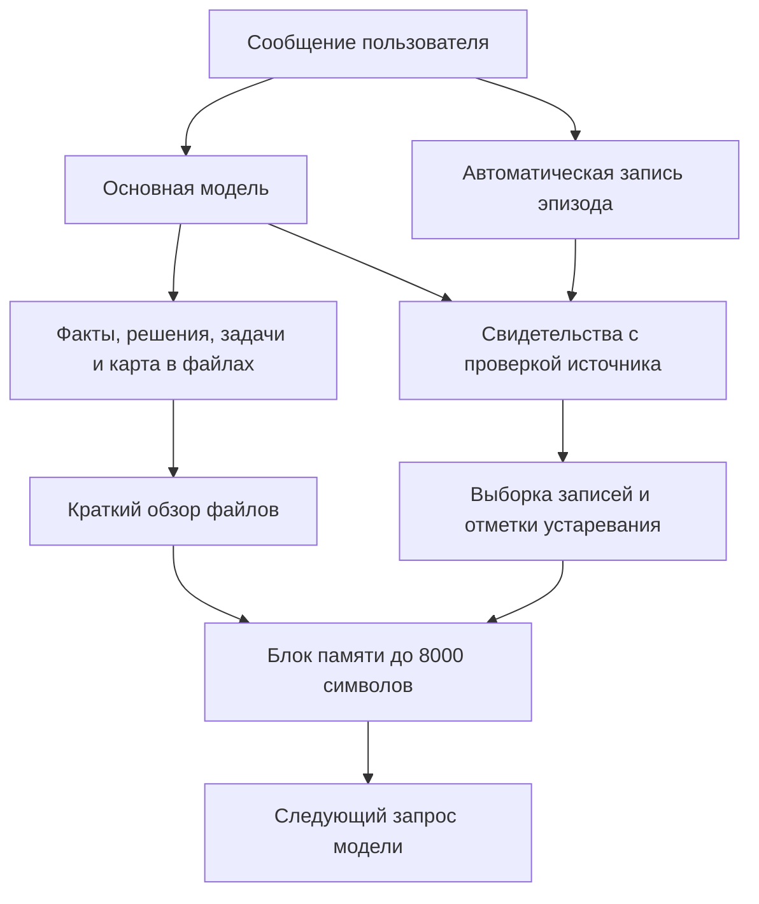

# Как устроена память

[На главную](../README.md) · [Руководство](GUIDE.md)

Память разделяет **текущее знание**, **его происхождение** и **материал, который нужно показать модели сейчас**. Это помогает исправлять решения без потери истории и не загружать весь архив в каждый запрос.

## 1. Текущие знания: обычные файлы

`MEMORY.md` отвечает на вопрос «что верно сейчас», `adr/` — «что решили и почему», `todo.json` — «что делать дальше», `PROJECT.md` — «куда смотреть». `DESIGN.md` хранит визуальные договорённости.

Документы поддерживает агент по мере работы; человек тоже может их исправить. Если реестр противоречит свежему решению пользователя или проверенному коду, нужно обратиться к первоисточнику.

Общий отпечаток отслеживает `MEMORY.md`, `todo.json`, `PROJECT.md`, `architecture.json` и Markdown внутри `adr/`. `DESIGN.md` и произвольные документы в этот набор не входят. Их нужно читать отдельно; при использовании как файлового свидетельства проверяется их собственный хеш.

## 2. Эпизоды: что было сказано

Расширение автоматически сохраняет входной запрос и текстовые части ответов ассистента в SQLite. Полные результаты инструментов, изображения и внутренние рассуждения таким способом не архивируются.

Эпизод не становится фактом автоматически. Фраза «можно попробовать Redis» остаётся обсуждением, пока агент не оформит её с подходящим статусом и источником. Поиск эпизодов позволяет вернуться к словам, но не заменяет актуальные документы.

## 3. Реестр: источники и версии

`project_memory` принимает факты, решения, процедуры, навигацию и задачи. У записи есть ID, версия, статус и источник. Для решения требуется причина.

Расширение проверяет цитату в сообщении или файле. Для текущего пользователя подставляет ID эпизода; для файла вычисляет хеш. Принятое решение требует пользовательского источника, а причина — точного фрагмента цитаты. Предположение ассистента нельзя записать как активный факт или принятое решение через этот путь.

Это **проверка происхождения**, не доказательство истинности. Пользователь может ошибиться, а точная цитата не гарантирует корректность вывода. Если причина не названа, нельзя выдумать её для прохождения проверки.

Исправление использует тот же ID и ожидаемую текущую версию. Несовпадение вызывает конфликт вместо тихой перезаписи. Старые версии доступны через `history`. Связи между ID поддерживаются, но графового поиска нет.

## 4. Актуальность: что могло устареть

Запись получает `STALE`, если изменился её файловый источник или общий отпечаток основных документов. Например, замена провайдера в `MEMORY.md` делает прежние записи подозрительными до перепроверки.

Проверка консервативная: изменение одного основного файла может пометить все прежние записи. Она обнаруживает изменение, но не понимает, какие факты логически опровергнуты. `STALE` не удаляет запись и не исправляет её автоматически.

## 5. Доставка контекста и расход

Перед запросом модели расширение собирает обзор основных файлов, предыдущую сводку и выборку реестра. Старый служебный блок заменяется новым: копии блока не накапливаются в передаваемом контексте.

Поиск текстовый: слова запроса сопоставляются с текстом, ID и причиной. Принятые решения и активные задачи допускаются в выборку даже без совпадения слов, но ограничение размера может исключить часть записей. Синонимы и перефразирование не распознаются как в семантическом поиске.

Обзор файлов ограничен 2400 символами, автоматическая выборка реестра — 3200, весь блок — 8000. Это **символы, не токены**. Процент экономии не измерен: блок добавляет текст, а модель расходует токены на чтение, запись и исправление ошибок. Если обзора мало, агент должен открыть полный источник.

## 6. Состояние работы и архитектура

Checkpoint — короткая сводка, не снимок файлов и не Git-коммит. Он записывается с изменениями реестра в транзакции SQLite. Изменения Markdown и SQLite не образуют общую транзакцию.

Завершение сессии сообщает о пропущенной сводке или нарушениях, но не запускает бесконечное «досохранение» моделью. Перед сжатием контекста проверяется доступность базы; собственного LLM-суммаризатора нет.

Архитектурные правила ищут запрещённые подстроки в заданных файлах. Нарушение возвращается отдельно: **память может успешно сохраниться при проваленной архитектурной проверке**. Это не замена линтеру, тестам и ограничениям доступа.

## Граница автоматики

| Само расширение | Основная модель или человек |
| --- | --- |
| Записывает текстовые эпизоды | Выделяет важное из обсуждения |
| Проверяет источник и версию | Формулирует факт и корректную причину |
| Выявляет изменения источников | Проверяет, устарел ли смысл записи |
| Доставляет ограниченный контекст | Читает полные файлы при необходимости |
| Проверяет заданные запреты | Определяет архитектуру проекта |
| Сообщает о проблемах | Исправляет знания или код |

Расширение не делает отдельных LLM-вызовов. Основная модель и стандартные функции OMP, например сжатие контекста, расходуют ресурсы согласно настройкам OMP.
